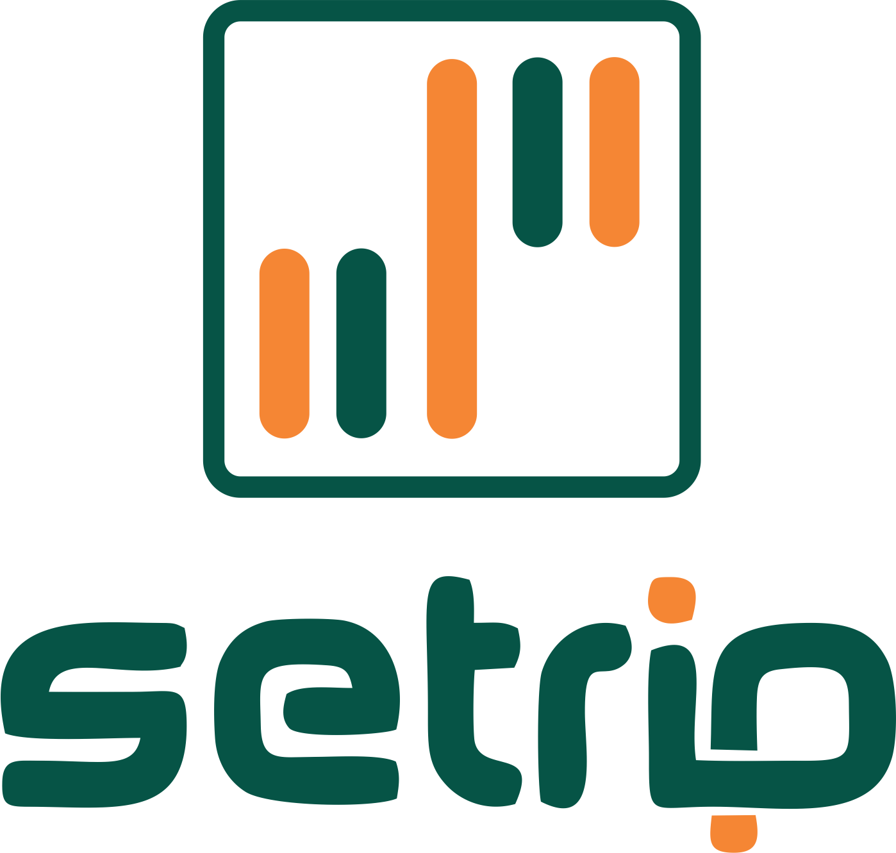

<div id="top"></div>

[![Contributors][contributors-shield]][contributors-url]
[![Forks][forks-shield]][forks-url]
[![Stargazers][stars-shield]][stars-url]
[![Issues][issues-shield]][issues-url]
[![MIT License][license-shield]][license-url]
[![LinkedIn][linkedin-shield]][linkedin-url]


<!-- PROJECT LOGO -->
<br />
<div align="center">
  <a href="https://github.com/rivaldofez/Tok-project">
    
  </a>

  <h3 align="center">An App to Secure and Enchance Travelling Experience During Pandemic</h3>
  </br>
</div>


<!-- TABLE OF CONTENTS -->
<details>
  <summary>Table of Contents</summary>
  <ol>
    <li>
      <a href="#about-the-project">About The Project</a>
      <ul>
        <li><a href="#built-with">Built With</a></li>
      </ul>
    </li>
    <li>
      <a href="#getting-started">Getting Started</a>
      <ul>
        <li><a href="#prerequisites">Prerequisites</a></li>
        <li><a href="#installation">Installation</a></li>
      </ul>
    </li>
    <li><a href="#contributing">Contributing</a></li>
    <li><a href="#contact">Contact</a></li>
    <li><a href="#acknowledgments">Acknowledgments</a></li>
  </ol>
</details>


<!-- ABOUT THE PROJECT -->
## About The Project

![Product Name Screen Shot][product-screenshot]

SETRIP is an apps for you to secure your travelling experience during pandemic Covid-19 using checkin-checkout feature. This apps also have additional feature to enchance yout experience such as social media, AI Camera, shop and nearby location


### Built With

This apps built with

* [Android Studio](https://developer.android.com/studio)
* [Java](https://kotlinlang.org/)
* [Glide](https://github.com/bumptech/glide)
* [Navigaton Bar](https://github.com/gauravk95/bubble-navigation)
* [Firebase](https://firebase.google.com/)
* [Google Maps](https://developers.google.com/maps)

<p align="right">(<a href="#top">back to top</a>)</p>


<!-- GETTING STARTED -->
## Getting Started

To copy this project, you must have android studio to open and build copy of the project cloned via github

### Prerequisites

Clone repository using git
* git
  ```sh
  git clone https://github.com/rivaldofez/Tok-project.git
  ```

### Installation

Installation steps

1. Download and setup your android studio from [Android Studio](https://developer.android.com/studio)
2. Load the project and build

<p align="right">(<a href="#top">back to top</a>)</p>


<!-- CONTRIBUTING -->
## Contributing

Contributions are things that make the open source community be an amazing place to learn, invent, and create new technologies. Any contributions you make are **greatly appreciated**.

If you have a suggestion that would make this better, please fork the repo and create a pull request. You can also simply open an issue with the tag "improvement".

1. Fork the Project
2. Create your Feature Branch (`git checkout -b feature/ImprovementFeature`)
3. Commit your Changes (`git commit -m 'Add some ImprovementFeature'`)
4. Push to the Branch (`git push origin feature/ImprovementFeature`)
5. Open a Pull Request

<p align="right">(<a href="#top">back to top</a>)</p>


<!-- CONTACT -->
## Contact

Rivaldo Fernandes - [@rivaldofez](https://twitter.com/rivaldofez) - rivaldofez@gmail.com

Project Link: [https://github.com/rivaldofez/Tok-project](https://github.com/rivaldofez/Tok-project)

<p align="right">(<a href="#top">back to top</a>)</p>


<!-- ACKNOWLEDGMENTS -->
## Acknowledgments

This apps is my submission at ITCC 2020 and thankfully our team got Second Winner 🤩


<!-- MARKDOWN LINKS & IMAGES -->
<!-- https://www.markdownguide.org/basic-syntax/#reference-style-links -->
[contributors-shield]: https://img.shields.io/github/contributors/rivaldofez/Tok-project.svg?style=for-the-badge

[contributors-url]: https://github.com/rivaldofez/Tok-project/graphs/contributors

[forks-shield]: https://img.shields.io/github/forks/rivaldofez/Tok-project.svg?style=for-the-badge

[forks-url]: https://github.com/rivaldofez/Tok-project/network/members

[stars-shield]: https://img.shields.io/github/stars/rivaldofez/Tok-project.svg?style=for-the-badge

[stars-url]: https://github.com/othneildrew/Best-README-Template/stargazers

[issues-shield]: https://img.shields.io/github/issues/othneildrew/Best-README-Template.svg?style=for-the-badge

[issues-url]: https://github.com/rivaldofez/Tok-project/issues

[license-shield]: https://img.shields.io/github/license/rivaldofez/Tok-project.svg?style=for-the-badge

[license-url]: https://github.com/rivaldofez/Tok-project/blob/master/LICENSE.txt

[linkedin-shield]: https://img.shields.io/badge/-LinkedIn-black.svg?style=for-the-badge&logo=linkedin&colorB=555

[linkedin-url]: https://www.linkedin.com/in/rivaldofez

[product-screenshot]: images/SS01.png
